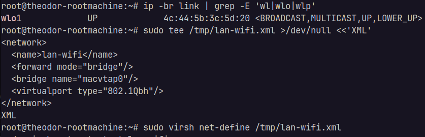
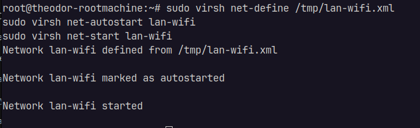
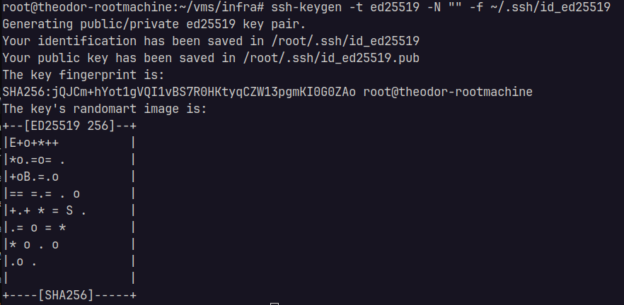
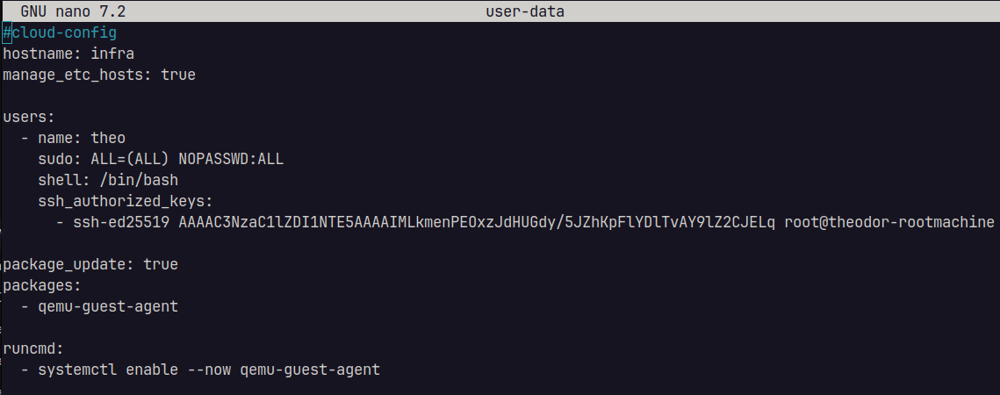
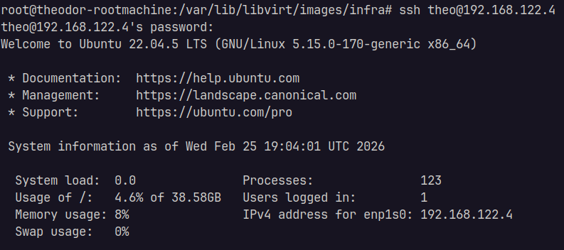

<!-- Creare VLAN in retea + VM infra -->
### Creare LAN: `lan-wifi`: un vor fi prezente toate VM-urile

Acest `lan-wifi` a fost creat pentru a putea face `bridge` intre masinile conectate pe o interfata `wifi` (server-ul bare metal este laptop conectat in retea prin WiFi, iar aceasta este singura metoda.




# Creare VM de monitorizare si configurarea infrastructura cu cloud-init + cloud image:

Instalare utilitare:
```
sudo apt install -y cloud-image-utils libguestfs-tools wget
```

Unde:
- `cloud-image`: Este o imagine Ubuntu deja pregătită pentru VM: fără installer,minimală,pregătită să primească config la boot
- `cloud-init`: la PRIMUL boot al VM-ului:creează user, setează parola sau cheia SSH, setează hostname,instalează pachete,rulează comenzi
Aceasta imagine(ISO) este oficiala UBUNTU.

Download Ubuntu 22.04 ISO in folder-ul de infrastructura pentru a folosi la creearea VM-ului:

```
mkdir -p ~/vms/infra
cd ~/vms/infra
wget -O ubuntu.qcow2 https://cloud-images.ubuntu.com/jammy/current/jammy-server-cloudimg-amd64.img
```

Se va descarca imaginea custom: `ubuntu.qcow2` -> imagine optimizata pentru a rula intr-un mediu virtualizat, oficiala Ubuntu, pre-configurata
Vom redenumi imaginea pentru a o putea refolosi + alocare de 50GB:
```
cp ubuntu.qcow2 infra.qcow2
qemu-img resize infra.qcow2 50G
```
Apoi vom configura VM-ul:

1. Generare cheie SSH pentru noul VM:


2. Config `user-data` si `meta-data`:


Incarcare datele de configurare in imaginea ISO cloud-init `infra-seed.iso`: `cloud-localds infra-seed.iso user-data meta-data`
Aceasta imagine va face configurarea vazuta mai sus.

In crearea VM-ului vom incarca ambele ISO-uri:
- primul: imaginea cu OS `qcow2`
- al doilea: configul OS-ului mentionat: `infra-seed.iso`

Acestea sunt citite ca discuri -> asa functioneza citirea KVM-ului (hypervisor-ul de virtualizare a linux-ului)

### Creare VM: atasarea IOS-uri, configurare VM si introducerea in retea
In cazul virtualizatii cu KVM, avem prezente 2 retele:
1. Retea "Routerului" unde toate device-urile/VM-urile sunt conectate: `192.168.1.0/24`
2. O retea Virtuala NAT KVM

Pentru moment vom crea o singura interfata`(wlo1)`, conectata la reteaua router-ului (bridge realizat prin "reteaua" LAN `wifi-lan` creata anterior)

Comanda creare VM prin KVM:

```
sudo virt-install \
  --name infra \
  --memory 3072 \
  --vcpus 2 \
  --cpu host \
  --disk path=/var/lib/libvirt/images/infra/infra.qcow2,format=qcow2,bus=virtio \
  --disk path=/var/lib/libvirt/images/infra/infra-seed.iso,device=cdrom \
  --os-variant ubuntu22.04 \
  --network network=default,model=virtio \
  --graphics none \
  --import \
  --noautoconsole
```

And by tryng SSH:


Arhitectura actuala:
```
Laptop admin (client SSH) - 192.168.1.146/24
        |
        |  LAN/Wi-Fi 192.168.1.0/24 (gateway ex. 192.168.1.1)
        |
Host KVM (Ubuntu Server) - 192.168.1.50/24
        |
        |  libvirt NAT network: 192.168.122.0/24 (Gateway pe if `virbr0`: 192.168.122.1)
        |
VM infra - 192.168.122.4/24 (NIC: enp1s0, DHCP)
```
