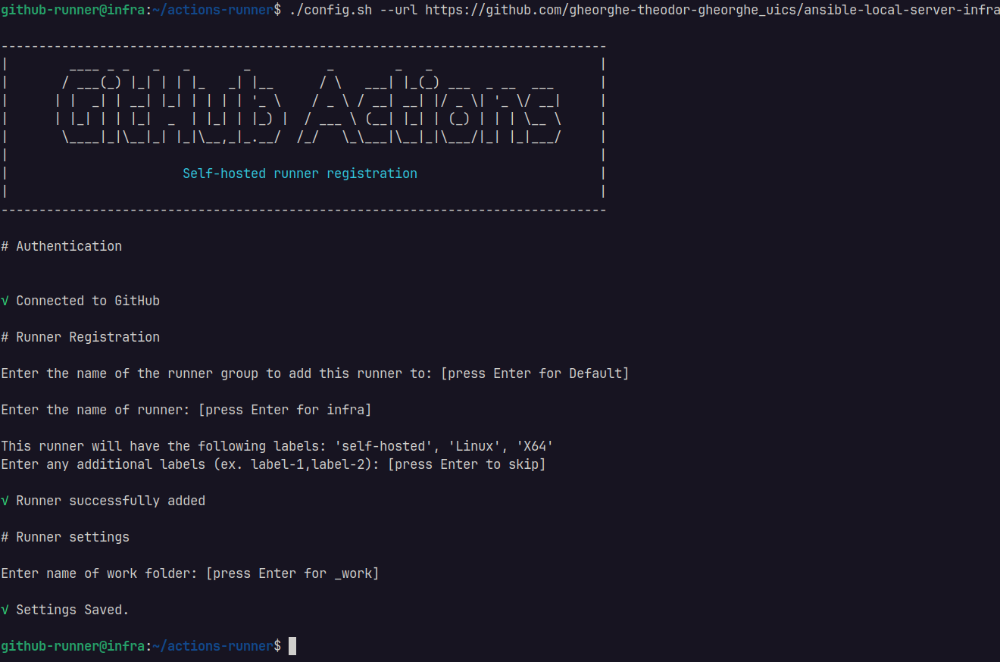
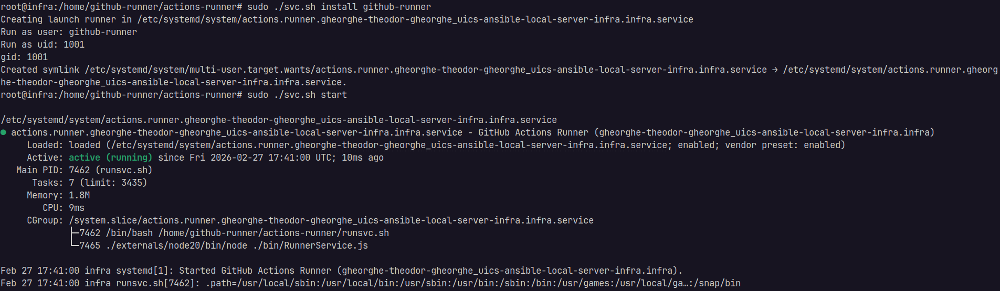
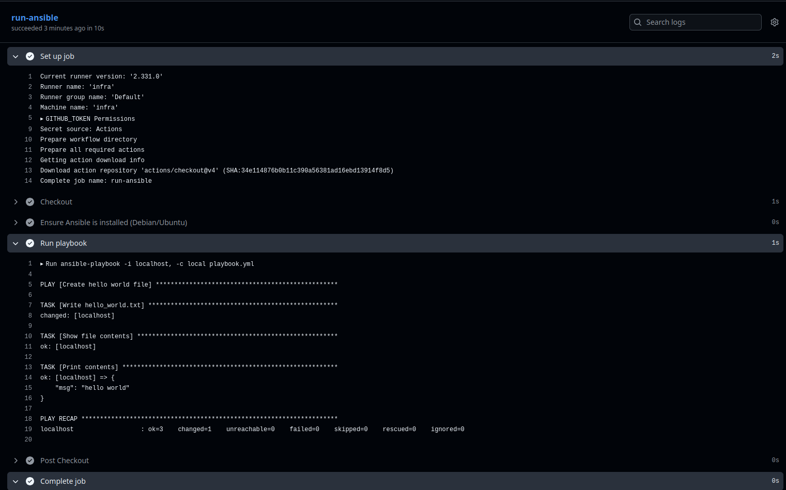
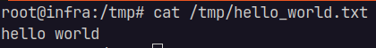

# 3. Configurare servere cu Ansible

- configurare GitHub Runner on Infra VM cu GitHub Actions
- creare Ansible Configuration Structure
- configurare DNS server cu bind9 + ansible
- configurare prometheus metrics

### Instalare GitHub Runner

1. Creare `gitlab-runnner` user:

```bash
mkdir -p ~/actions-runner && cd ~/actions-runner
sudo adduser --disabled-password --gecos "" github-runner
```

2. Instalare local - pe VM-ul infra  


3. Pornire serviciu:  


4. Testare Runner: vom crea un repository cu un playbook de test de ansible + un github actions pipeline

- GitHub Actions este un CI/CD care la fiecare push pe `main` va rula playbook-ul nostru (pipeline-ul)
- Pipeline (scrierea un fisier in `/tmp`):

```yaml
name: Ansible hello_world on self-hosted runner

on:
  workflow_dispatch:
  push:
    branches: [ "main" ]
    paths:
      - "playbook.yml"
      - ".github/workflows/ansible-workflow.yml"

jobs:
  run-ansible:
    runs-on: infra

    steps:
      - name: Checkout
        uses: actions/checkout@v4

      - name: Ensure Ansible is installed (Debian/Ubuntu)
        run: |
          if ! command -v ansible-playbook >/dev/null 2>&1; then
            sudo apt-get update
            sudo apt-get install -y ansible
          fi
          ansible-playbook --version

      - name: Run playbook
        run: ansible-playbook -i localhost, -c local playbook.yml
```

- Rulare pipeline Actions local in runner local:  


- Verificare:  


GitHub Repository (private)
